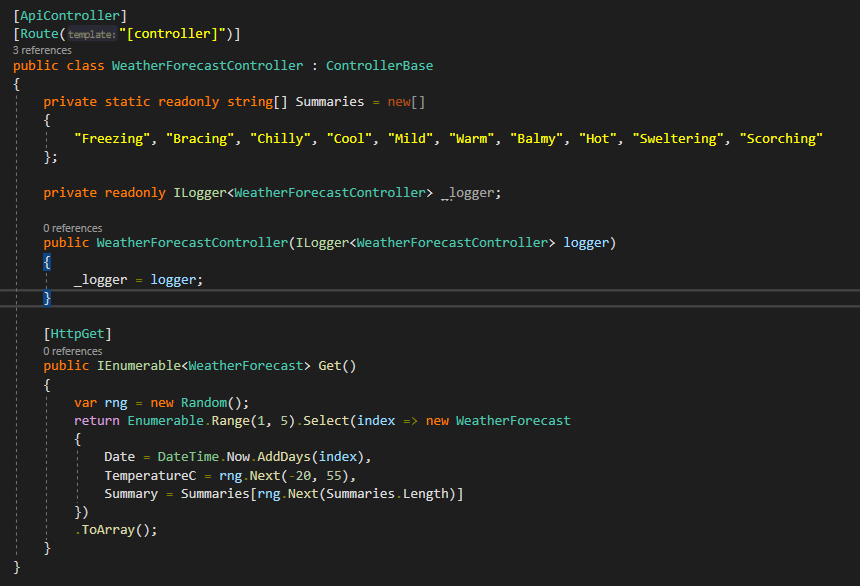
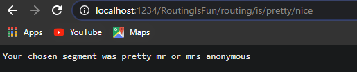

# ASP API Example Project

## Erstellen des Projektes


### **1. Authentication**
Hier kann man theoretisch die von ASP builtin authentication "Identity" oder Windows authentication nutzen, was für eine API aber eher unpassend ist.

### **2. HTTPS**
Dont.

## Übersicht des Projektes


### **Program.cs**
In der Program.cs wird das Hosting für die ASP Anwendung "definiert" und gebaut.


Um eine ASP API zu hosten gibt es die Möglichkeiten IIS (Win-only) und Kestrel. <br>
Standardmäßig wird IIS für das Hosten von ASP Anwendungen genutzt. 
Um Kestrel zu nutzen müsste die auskommentierte Zeile hier einkommentiert werden.
Außerdem muss die Zeile 
```Csharp 
webBuilder.UseKestrel();
```
hinzugefügt werden. 

### **Startup.cs**
In Startup.cs kann alles für die Anwendung relevante initialisiert werden. <br>
Da ASP komplett auf dem IoC (Inversion of control) Prinzip aufbaut, können in der Startup.cs z.B. auch Singletons von Klassen erzeugt werden die in einzelne Controller übergeben werden. <br>
Im Startup können außerdem Standardrouten sowie Exceptionhandling, Middleware und einige andere Features initialisiert werden.

### **Settings files**
Dont. Yet.

### **Controller**
Controller beinhalten die Endpunkte der API.
Im Projekt ist direkt ein Beispielcontroller enthalten.



Das Attribut **ApiController** ist das Flag, welches dafür sorg das diese Klasse als Controller/ Endpunkte gemapped werden.<br>
Das Attribut **Route("[controller]")** beschreibt die Route des Controllers.
"[controller]" ist hierbei der Platzhalter der beim Mappen der Route automatisch durch den Namen der Klasse (ohne "Controller" also "/WeatherForecast") geändert wird. <br>
Das **Route** Attribut kann auch über jeder Methode innerhalb dieser Klasse sein, welche einen Endpunkt darstellen.


Durch das **[HttpGet]** ist diese Klasse ein Endpunkt. Und dadurch das die Klasse kein **[Route()]** Attribut hat, ist es das default Get der Klasse bzw. des Endpunktes **"/WeatherForecast"**.


## Custom Routing / Segments / Query Parameter


### **ExampleGet** 
Die Route **"/[controller]/routing/is/{segment/nice}"** wird aufgelöst zu **"http://localhost:1234/RoutingIsFun/routing/is/{segment}/fun?name="** wobei segment dann irgendein beliebiger string sein kann wie z.B. **"http://localhost:1234/RoutingIsFun/routing/is/not/fun?name="** und name ist ein optionaler Queryparameter.
Das **[FromQuery]string name** beim name paramter steht dafür, das dieser aus der query kommt bzw. optional ist.
Im Beispiel habe ich "pretty" als segment genommen.



Mit queryparamter: 


### **GiveBody**
**"/[controller]/[action]"** wird aufgelöst zu **"http://localhost:1234/RoutingIsFun/GiveBody"**

Das **[FromBody]** Attribut beim customer paramter versucht den body (JSON, ich hab noch nicht getestet ob XML auch geht) zu parsen zum angegebenen Typen (hier Customer).

Return Typ ist hier ebenfalls Customer was per default in JSON geparsed wird.


Ein Request sieht dann so aus:


## Swagger
Um Swagger zu nutzen muss zuerst folgendes Paket installiert werden:
```powershell
Install-Package Swashbuckle.AspNetCore
```

Dann muss in ConfigureServices folgendes hinzugefügt werden: 
```C#
services.AddSwaggerGen(c =>
{
    c.SwaggerDoc("v1", new OpenApiInfo { Title = "My API", Version = "v1" });
});
```

und in Configure das hier:
```C#
pp.UseSwaggerUI(c =>
{
    c.SwaggerEndpoint("/swagger/v1/swagger.json", "My API V1");
});

app.UseSwagger();
```


## Dev Exceptions
Es gibt in ASP die default Einstellung der dev exception womit, wenn eine Exception geschmissen wird, der response so aussieht: 


## Views
Erstmal mit dem Rest rumspielen. Dann kommen Views :D